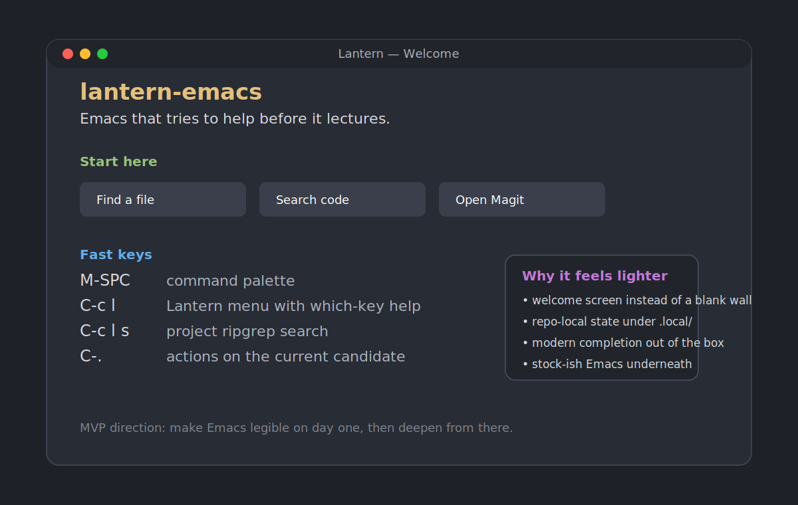

# lantern-emacs

Lantern is an opinionated Emacs starter for people who want the power of a Doom/Spacemacs-style setup without the hazing ritual.

Clone it. Run one script. Get a polished editor with a welcome screen, modern completion, project navigation, Magit, sane defaults, and an Eglot-based LSP path. It stays close enough to stock Emacs that you can still learn normal Emacs, but it does more hand-holding on day one.

**Current target:** Emacs 29.1 or newer.



## Thesis

Most Emacs distributions optimize for people who already buy the premise. Lantern is aimed at the person who is curious, capable, and slightly suspicious.

The bet:

- onboarding matters as much as package selection
- discoverability beats memorizing a secret society of key chords
- the first run should feel helpful, not like being dropped into a cathedral with no map
- an MVP should already be pleasant enough to use for real code and writing

## What works already

- isolated launcher via `./bin/lantern`
- repo-local package/cache state in `.local/`
- first-run welcome buffer with clickable actions
- real command center on `C-c l c` for recent projects, docs, diagnostics, git, and language actions
- quick appearance controls for theme, font size, and tab workflow
- command palette on `M-SPC`
- discoverable leader map on `C-c l` with `which-key`
- Vertico + Orderless + Marginalia + Consult + Embark for navigation/completion
- Corfu + Cape for in-buffer completion
- project and file navigation tuned around built-in `project.el`
- Magit wired in
- polished UI with `doom-themes` and `doom-modeline`
- batteries for common text/code formats: Markdown, YAML, JSON, TOML, Dockerfile, web, TypeScript, Go, Rust
- Eglot hooks for the common language-server path
- batch smoke test and doctor commands

## Requirements

- Emacs 29.1+
- Git
- ripgrep (`rg`) for the nicest project search path

## Quick start

### Option 1: run Lantern without touching your normal Emacs

```bash
git clone git@github.com:AloJarbas/lantern-emacs.git
cd lantern-emacs
./bin/bootstrap
./bin/lantern
```

This keeps package installs and cache files inside the repo under `.local/`.

### Option 2: use it as your main Emacs config

```bash
git clone git@github.com:AloJarbas/lantern-emacs.git ~/.emacs.d
cd ~/.emacs.d
./bin/bootstrap
emacs
```

## First five minutes

When Lantern starts without a file, it opens a welcome buffer instead of dumping you into a blank scratch buffer.

Use these immediately:

- `M-SPC`: command palette (`M-x`, but easier to reach and easier to remember)
- `C-c l`: Lantern keymap; `which-key` expands it for you
- `C-c l c`: command center for the common day-one actions in one place
- `C-c l t`: toggle dark/light theme
- `C-c l =`: bigger text
- `C-c l -`: smaller text
- `C-c l T`: open a new tab
- `C-c l f`: find file (project-aware when possible)
- `C-c l s`: search project text with `consult-ripgrep`
- `C-c l b`: switch buffer
- `C-c l p`: switch project
- `C-c l g`: open Magit
- `C-c l d`: run Lantern doctor
- `C-c l w`: reopen the welcome screen
- `C-.`: Embark actions on the current minibuffer candidate

## Bootstrap and verification

```bash
./bin/bootstrap     # installs packages and runs the smoke test (Emacs 29.1+)
./bin/doctor        # prints tool + language-server status
./bin/syntax-check  # parse-checks the Lisp files without loading packages
```

The smoke test loads the full config in batch mode and checks that the core onboarding, navigation, and doctor commands are live. The syntax check exists so an older host can still catch broken Lisp before you get to a supported Emacs build.

## LSP path

Lantern uses `eglot` instead of a giant abstraction tower. That keeps the setup lighter and closer to stock Emacs.

Lantern does **not** auto-install language servers yet. It wires the editor side and leaves server installation explicit. See [`docs/languages.md`](docs/languages.md).

## Project layout

- `early-init.el`: early startup settings
- `init.el`: entrypoint
- `lisp/lantern-core.el`: bootstrap, defaults, doctor, filesystem layout
- `lisp/lantern-ui.el`: theme and UI polish
- `lisp/lantern-completion.el`: minibuffer + in-buffer completion stack
- `lisp/lantern-project.el`: project, file, search, Git ergonomics
- `lisp/lantern-prog.el`: syntax, coding defaults, Eglot, common modes
- `lisp/lantern-command-center.el`: the all-in-one command hub for projects, docs, git, diagnostics, and language actions
- `lisp/lantern-onboarding.el`: welcome screen and first-run flow
- `lisp/lantern-keys.el`: keybindings and discoverability
- `scripts/verify.el`: batch smoke test

## Rough edges on purpose

This is an honest MVP, not a fake “v1” with a glossy README and no spine.

What is still rough:

- no package pinning or lockfile story yet
- no tree-sitter layer yet
- no built-in terminal/file-tree UI opinions yet
- no OS-specific installer beyond the shell scripts
- no automatic language-server installation yet
- no migration story from existing Emacs configs yet

## Near-term next move

Add guided language-server install helpers or doctor-driven fix suggestions for the common stacks, so the first real coding session goes smoother after the UI onboarding is done.
